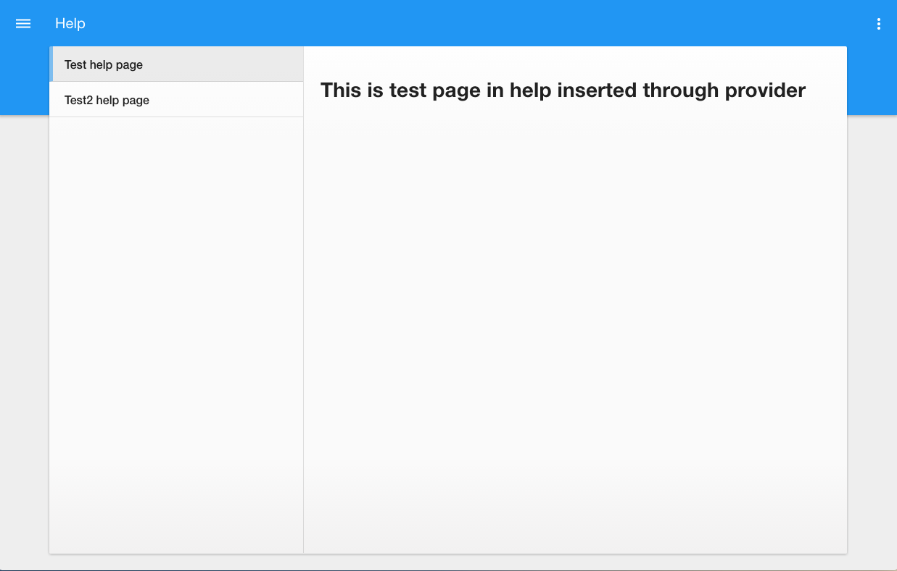

# Pip.WebUI Help Components

Help Web components is a sub-module for Pip.Services platform and can be used in applications
based on the platform.

This module provides next functionality:

* All-sufficient and styled **Help** UI component
* Service for more subtle configuring **Help** component

In the version 1.0.0 the implementation was cleaned up and covered with unit tests.
Implementation became fully portable across browser and devices.


### The complete library

 * https://github.com/pip-webui/pip-webui

## Demos

[Examples Online](http://webui.pipdevs.com/pip-webui-help/index.html)


## Quick links

* [Module dependencies](#dependencies)
* [Components](#components)
  - [Help page visual component](#help-page-component)
  - [Help page service](#help-page-service)
* [Browsers compatibility](#compatibility)
* [Community](#community)
* [Contributing](#contributing)
* [Build](#build)
* [License](#license)


## <a name="dependencies"></a>Module dependencies

* <a href="https://github.com/pip-webui/pip-webui-tasks">pip-webui-tasks</a> - Helpful tasks for development
* <a href="https://github.com/pip-webui/pip-webui-lib">pip-webui-lib</a> - Vendor libraries
* <a href="https://github.com/pip-webui/pip-webui-css">pip-webui-css</a> - CSS Framework
* <a href="https://github.com/pip-webui/pip-webui-core">pip-webui-core</a> - Core platform module
* <a href="https://github.com/pip-webui/pip-webui-rest">pip-webui-rest</a> - REST API module
* <a href="https://github.com/pip-webui/pip-webui-controls">pip-webui-controls</a> - Assets of control components
* <a href="https://github.com/pip-webui/pip-webui-layouts">pip-webui-layouts</a> - Document layouts
* <a href="https://github.com/pip-webui/pip-webui-nav">pip-webui-nav</a> - All-sufficient UI navigation components
* <a href="https://github.com/pip-webui/pip-webui-pictures">pip-webui-pictures</a> - UI picture components
* <a href="https://github.com/pip-webui/pip-webui-locations">pip-webui-locations</a> - UI components to define and show users location
* <a href="https://github.com/pip-webui/pip-webui-entry">pip-webui-entry</a> - All-sufficient UI component for any authenticate states
* <a href="https://github.com/pip-webui/pip-webui-test">pip-webui-test</a> - Provides mocked data needed for unit testing


## <a name="components"></a>Module components

### <a name="help-page-component"></a>Help page visual component
<div style="border: 3px ridge #c8d2df">
    
</div>

Help component renders simple document with navigation list and content area. This components requires user's authentication.
The component markup has responsive layout. This components is interacted with page header component, supports
keyboard navigation through the navigation list and internationalization.

Help page component [API reference](http://link.com)

[Online Example](http://webui.pipdevs.com/pip-webui-help/index.html#/help/test)

<br/>

### <a name="help-page-service"></a>Help page Service

Help page service provides an interface for configuring component. It implements next features:

* add new page in component navigation menu
* control access rights on every component pages
* establish default page

Help page service [API reference](http://link.com)

Example of adding new page is performed below:

```javascript
angular
    .module('appHelp', ['pipHelp'])
    .config(function (pipHelpProvider) {
        pipHelpProvider.addPage({
            state: 'test',
            title: 'Test help page',
            auth: true,
            stateConfig: {
                url: '/test',
                template: '<h1>This is test page in help inserted through provider</h1>'
            }
        })
    });
```

## <a name="compatibility"></a>Compatibility

PIP.WEBUI has been thoroughly tested against all major browsers and supports:

 * IE11+,
 * Edge
 * Chrome 47+,
 * Firefox 43
 * Opera 35

## <a name="community"></a>Community

* Follow [@pip.webui on Twitter](http://link.com)
* Subscribe to the [PIP.WebUI Newsletter](http://link.com)
* Have a question that's not a feature request or bug report? Discuss on the [PIP Forum](https://groups.google.com/forum/#!forum/pipdevs)
* Have a feature request or find a bug? [Submit an issue](http://link.com)
* Join our Community Slack Group! [PIP Worldwide](http://link.com)


## <a name="contributing"></a>Contributing

Developers interested in contributing should read the following guidelines:

* [Issue Guidelines](http://somelink.com)
* [Contributing Guidelines](http://somelink.com)
* [Coding guidelines](http://somelink.com)

> Please do **not** ask general questions in an issue. Issues are only to report bugs, request
  enhancements, or request new features. For general questions and discussions, use the
  [Pip Devs Forum](https://groups.google.com/forum/#!forum/pipdevs).

It is important to note that for each release, the [ChangeLog](CHANGELOG.md) is a resource that will
itemize all:

- Bug Fixes
- New Features
- Breaking Changes

## <a name="build"></a>Build

Projects environment deploy is occurred using npm and gulp.

First install or update your local project's **npm** tools:

```bash
# First install all the NPM tools:
npm install

# Or update
npm update
```

Then run the **gulp** tasks:

```bash
# To clean '/build' and '/dist' directories
gulp clean

# To build distribution files in the `/dist` directory
gulp build

# To launch samples (build will open samples/index page in web browser)
gulp launch
```

For more details on how the build process works and additional commands (available for testing and
debugging) developers should read the [Build Instructions](docs/guides/BUILD.md).


## <a name="license"></a>License

PIP.WebUI is under [MIT licensed](LICENSE).

